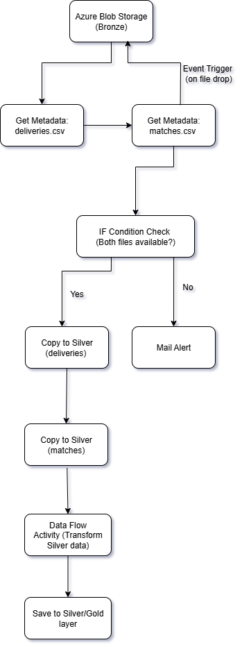
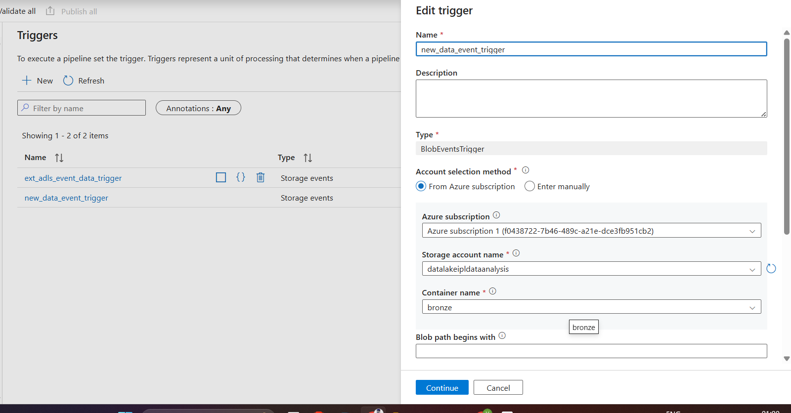
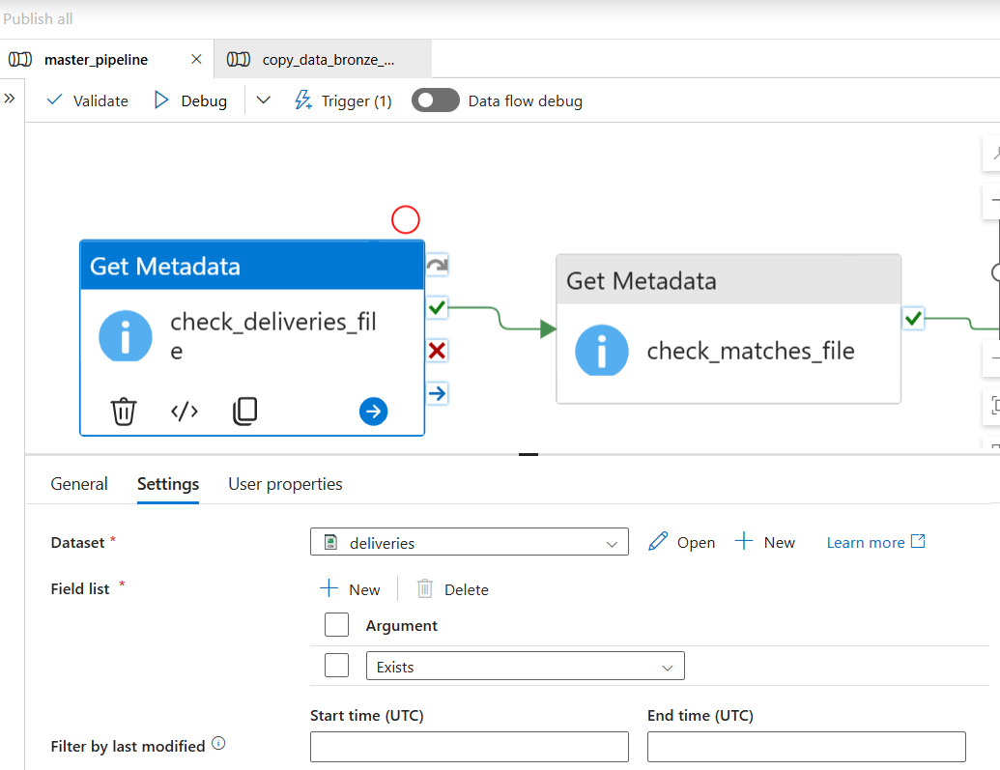
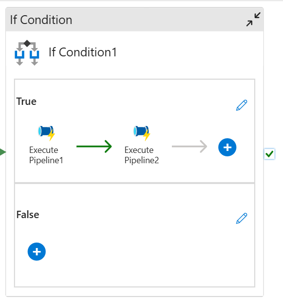
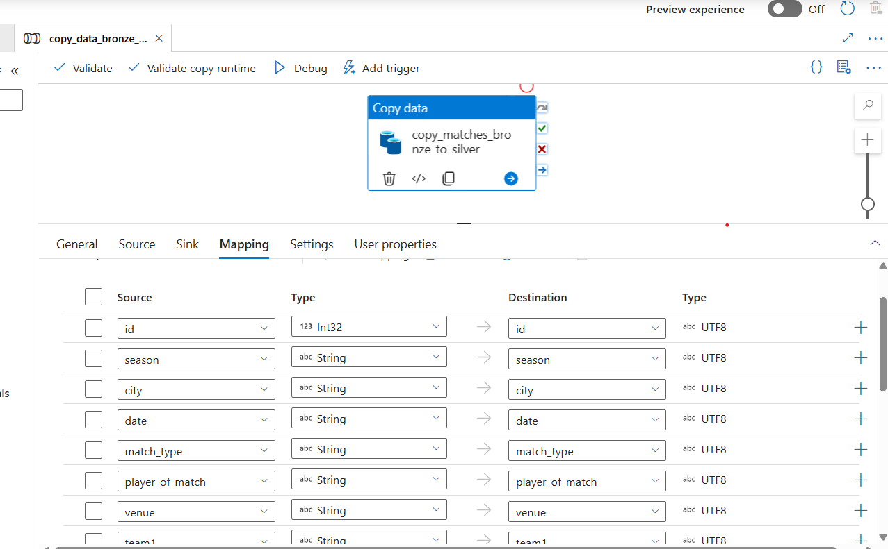
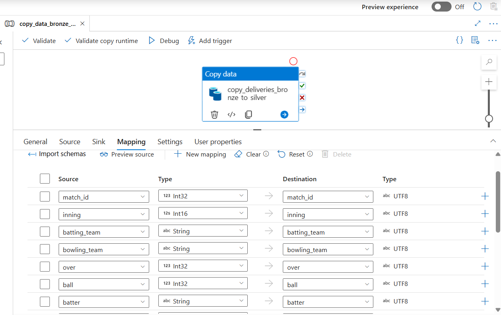
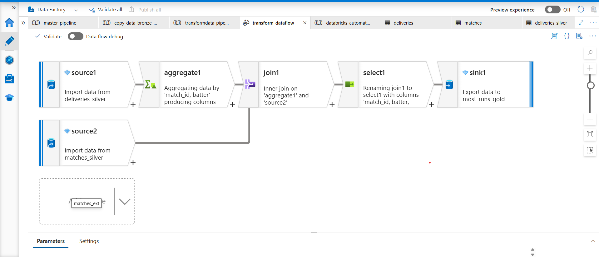

# 🏏 IPL Dataset - Azure Data Engineering Project

End-to-end Azure Data Factory pipeline to process IPL dataset using event-driven ingestion, metadata validation, and layered transformation Medallion architecture (Bronze → Silver -> Gold) architecture.

---

## 📌 Project Summary

- **Source Files**: `matches.csv` and `deliveries.csv`
- **Bronze Layer**: Raw ingestion using event-based triggers
- **Silver Layer**: Cleaned and transformed data using Data Flows
- **Orchestration**: Azure Data Factory Pipelines
- **Transformations**: Azure Data Flow inside ADF
- **Trigger**: Event-based trigger on ADLS container (`bronze`)

---

## 📁 Folder Structure


---

## 🧠 Architecture

This project follows a **Medallion Architecture** with Bronze and Silver layers.



---

## ⚙️ Step-by-Step Pipeline Breakdown

### 1️⃣ **Event Trigger: New File in Bronze**

- An event-based trigger runs when a new file is uploaded to the **bronze** container in Azure Data Lake Storage.
- Two files are expected: `matches.csv` and `deliveries.csv`.



---

### 2️⃣ **Get Metadata Activities**

- Check whether both `matches.csv` and `deliveries.csv` exist in the `bronze` container.



---

### 3️⃣ **If-Else Condition**

- If both files are available → proceed to process them.
- If not, the pipeline ends without errors.



---

### 4️⃣ **Copy Data Activities to Silver Layer**

#### ✅ Copy Matches Data

- Copies `matches.csv` from Bronze to Silver layer.



#### ✅ Copy Deliveries Data

- Copies `deliveries.csv` from Bronze to Silver layer.



---

### 5️⃣ **Data Flow: Transform Silver Layer**

- Cleans, joins, and applies transformations on the silver data using **ADF Data Flow**.



---

## 🧪 Technologies Used

| Service              | Purpose                             |
|----------------------|-------------------------------------|
| Azure Data Factory   | Orchestration and Data Movement     |
| Azure Data Lake Gen2 | Storage (Bronze and Silver Layers)  |
| ADF Data Flows       | Data transformation pipeline        |

---

## 🚀 Deployment Instructions

### 1. **Clone the Repo**
```bash
git clone https://github.com/vaibhav-kados/azure-adf-ipl-dataset-project.git

